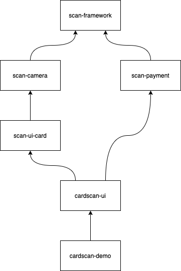

# Development

Development guide

## Contents

* [Dependencies](#dependencies)
* [Code Organization](#code-organization)
* [Building](#building)
* [Running Unit Tests](#running-unit-tests)
* [Using Running Android Tests](#running-android-tests)
* [Releasing](#releasing)

## Dependencies

This demo app requires `androidx` libraries for its user interface, and kotlin coroutine libraries for handling concurrency. Note that your app does not need to be written in kotlin to work with this library; The demo app is written in Java.

## Code Organization

This demo app consists of the following modules and a demo app.



This library consists of these modules and a demo app:
* [scan-framework](#scan-framework)
* [scan-camera](#scan-camera)
* [scan-payment](#scan-payment)
* [scan-ui-card](#scan-ui-card)
* [cardscan-ui](#cardscan-ui)

### scan-framework

[scan-framework](https://github.com/getbouncer/scan-framework-android) contains the framework used to scan images. See the [architecture document](https://github.com/getbouncer/scan-framework-android/tree/master/docs/architecture.md) for details on how it processes images from the camera.

### scan-camera

[scan-camera](https://github.com/getbouncer/scan-camera-android) contains the camera interfaces for setting up the camera on the device and receiving images from it. It also handles converting the images from the camera to a processable format.

### scan-payment

[scan-payment](https://github.com/getbouncer/scan-payment-android) contains the code for validating and managing payment cards.

### scan-ui-card

[scan-ui-card](https://github.com/getbouncer/scan-payment-android) contains some common functionality shared between user interfaces for scanning cards. This provides the card viewfinder, debug overlay, and base scan activity.

### cardscan-ui

[CardScan UI](https://github.com/getbouncer/cardscan-ui-android) provides a user interface for scanning payment cards. 

## Building

Check out the project using `git`. Note that this project makes use of submodules, so a `recursive` clone is recommended.
```bash
git clone --recursive https://github.com/getbouncer/cardscan-demo-android
```

To build the project, run the following command:
```bash
./gradlew demo:build
```

To create an APK release of the app, run the following command:
```bash
./gradlew demo:assembleRelease
```
This will place an APK file in `demo/build/outputs/apk`

## Contributing

CardScan libraries follow a standard github contribution flow.

1. Create a new github feature branch
    ```bash
    git checkout -b <your_github_name>/<your_feature_name>
    ```

1. Make your code changes

1. Push your branch to origin
    ```bash
    git push --set-upstream origin <your_branch_name>
    ```

1. Create a new pull request on github, and tag appropriate owners.

1. Once you have approval, merge your branch into master and delete your feature branch from github.

## Running Unit Tests

Unit tests can be run from android studio or from the command line. To execute from the command line, run the following command:
```bash
./gradlew test
```

## Running Android Tests

Android tests can be run from android studio or from the command line. To execute from the command line, run the following command:
```bash
./gradlew connectedAndroidTest
```

Note that these tests require that you have an emulator running or a physical device connected to your machine via `ADB`.

## Releasing

See the [release](release.md) documentation.
