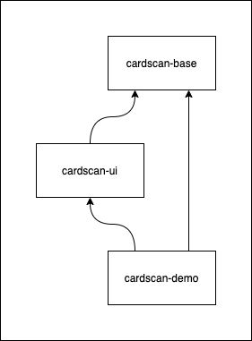

# Development

CardScan development guide

## Contents

* [Dependencies](#dependencies)
* [Code Organization](#code-organization)
* [Building](#building)
* [Running Unit Tests](#running-unit-tests)
* [Using Running Android Tests](#running-android-tests)
* [Releasing](#releasing)

## Dependencies

CardScan requires `androidx` libraries for its user interface, and kotlin coroutine libraries for handling concurrency. Note that your app does not need to be written in kotlin to work with CardScan; The demo app is written in Java.

## Code Organization

CardScan consists of two modules and a demo app. The base module provides the framework and machine learning models required to scan cards. The UI module provides a convenient interface for scanning cards.



### base

[CardScan Base](https://github.com/getbouncer/cardscan-base-android) contains the framework and machine learning models used to scan cards. See the [architecture document](https://github.com/getbouncer/cardscan-base-android/blob/master/docs/architecture.md) for details on how CardScan processes images from the camera.

#### ui

[CardScan UI](https://github.com/getbouncer/cardscan-ui-android) contains the user interface and camera code for scanning payment cards. The CardScan activity configures the framework from Base to accept images from the camera and handles converting the results to a consumable format. 

## Building

Check out the project using `git`. Note that this project makes use of submodules, so a `recursive` clone is recommended.
```bash
git clone --recursive https://github.com/getbouncer/cardscan-demo-android
```

To build the project, run the following command:
```bash
./gradlew demo:build
```

To create an APK release of the app, run the following command:
```bash
./gradlew demo:assembleRelease
```
This will place an APK file in `demo/build/outputs/apk`

## Contributing

CardScan libraries follow a standard github contribution flow.

1. Create a new github feature branch
    ```bash
    git checkout -b <your_github_name>/<your_feature_name>
    ```

1. Make your code changes

1. Push your branch to origin
    ```bash
    git push --set-upstream origin <your_branch_name>
    ```

1. Create a new pull request on github, and tag appropriate owners.

1. Once you have approval, merge your branch into master and delete your feature branch from github.

## Running Unit Tests

Unit tests can be run from android studio or from the command line. To execute from the command line, run the following command:
```bash
./gradlew test
```

## Running Android Tests

Android tests can be run from android studio or from the command line. To execute from the command line, run the following command:
```bash
./gradlew connectedAndroidTest
```

Note that these tests require that you have an emulator running or a physical device connected to your machine via `ADB`.

## Releasing

See the [release](release.md) documentation.
